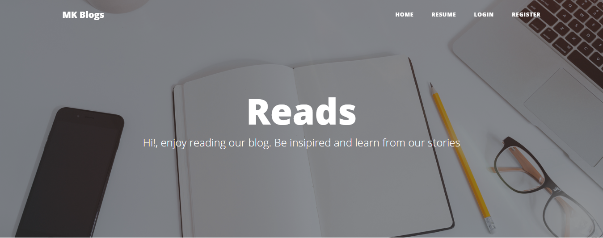

## Blog Site (CMS)

Simple multi auth blog site, with admin roles and permissions, like system and Facebook comment plugin system.

## Setup

-   clone repo
-   copy .env.example to .env
-   run php artisan key:generate
-   setup .env database credentials
-   run composer install
-   run npm install && npm run dev
-   run php artisan migrate --seed
-   run php artisan serve
